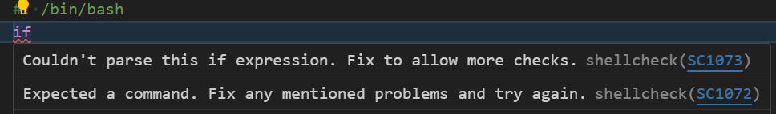

<!-- @format -->

# vscode 中配置 shell 提示补全,语法检查,格式化

## 1. shell 提示补全

vscode 扩展搜索`shellman`,安装扩展

扩展:

效果:


## 2. shell 语法检查

vscode 扩展搜索`ShellCheck`,安装扩展

扩展:

效果:


## 3. shell 格式化

vscode 扩展搜索`shell-format`,安装扩展

扩展:


前往 github 下载`https://github.com/mvdan/sh/releases`对应版本


复制完整的可执行程序路径

在 vscode`setting.json`添加设置

```json
"[shellscript]": {
    "editor.defaultFormatter": "foxundermoon.shell-format"
},
// 添加刚才复制的可执行程序路径
"shellformat.path": "D:\\WHYsoftware\\shfmt\\shfmt_v3.7.0_windows_386.exe"
```


还有一些细节根据自己需要调整就行.

END
