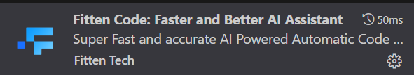

<!-- @format -->

# vscode 扩展推荐

这里推荐都是比较通用的扩展,适合日常使用,像是针对某些编程语言开发的插件这里就不推荐了,因为每个人的需求都不一样.

## 1. `Material Icon Theme`

一款 Material Design 风格的图标主题,可以让你的代码文件更加美观,便于识别.

效果:

## 2. `CodeSnap`

一款可以将代码片段保存为图片的插件,可以方便的分享代码片段.

效果:

## 3. `Code Translate`

一款纯粹的滑词翻译软件

效果:

## 4. `Project Manager`

一款可以管理多个项目的插件,可以快速的切换项目,并快速打开项目目录.

效果:

## 5. `Open`

效果:

使用操作系统的默认程序打开文件。

## 6. `Prettier - Code formatter`

一款可以格式化代码的插件,可以自动调整代码的格式,让代码更加统一美观.

## 7. `Todo Tree`

一款可以高亮显示 TODO,FIXME,XXX 等注释的插件,可以方便的看到代码中存在的待办事项.

## 8. `Sort JSON`

一款可以对 JSON 文件进行排序的插件.

## 9. `Markdown Preview Enhanced`

一款强大的 markdown 文件的插件,不仅可以方便的查看 markdown 文档的效果,还可以方便的进行 markdown 文档的导出为其它格式.

效果:

## 10. `Markdown Image`

一个方便在 Markdown 中插入图片的扩展,支持将图片存储在本地或第三方 CDN 服务中

## 11. `Database Client`

一个用于 VSCode 的数据库客户端,支持管理多种数据库连接,并且可以作为 SSH 客户端,其中 sql 语句补全功能非常强大,并且可以在 sql 文件中直接执行 sql 语句显示结果,记录执行过的 sql 语句.

效果:

## 12. `filesize`

可以显示文件一些基本信息的插件,非常小巧.

效果:

## 13. `Fitten Code`

一款可以帮助你编写代码的免费 AI 助手,可以自动补全代码,chat,与其它免费 AI 助手相比,优势是可以分析图片.

## 14. git 相关扩展

`Git Graph`: 一个 git 图形化工具,可以直观的展示 git 仓库的历史记录.
`Git History`: 可以查看 git 历史记录的插件,可以查看文件修改历史.
`Git Blame`: 可以查看每行代码的最后修改者和提交信息.
`Git Stash`: 可以更方便的管理 git stash.
`gitignore`: 可以管理 .gitignore 文件.
`Open in GitHub, Bitbucket, Gitlab, VisualStudio.com !`: 可以跳转到 Github,Bitbucket,Visualstudio.com 和 GitLab 中某个源代码行.
